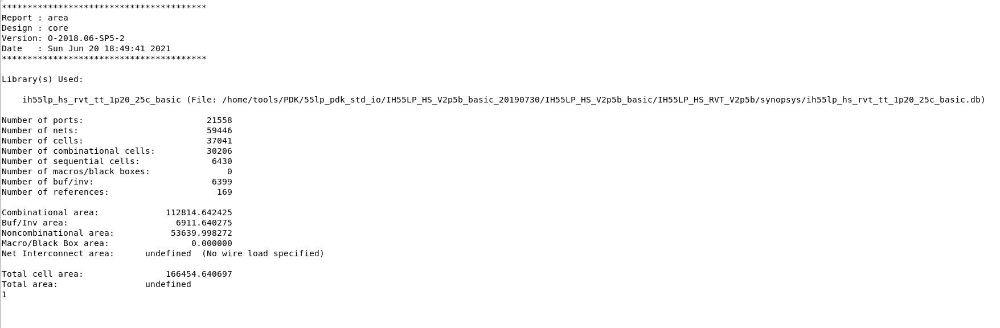

# 1. 综合

## 1.0 计算

$ns$ 换算成 $s$

$A \times P \times \frac{1}{f} \times N=166454.64um^2 \times 18.82mW \times 4 ns \times 62509 = 783,281,857,547.70$

$\approx 7.83282 \times 10^{11}$

## 1.1 Area

total area = 166454.640697

## 1.2 Power

power = 18.8180mW

## 1.3 Time

我们的时钟周期为 4ns

## 1.5 周期数

我们的在8通道输入输出的情况下周期数为 62509

## 1.5 网表

无 latch

# 2. 仿真

## 2.1 Running

跑起来的过程，仿真跑了非常久，产生了一个巨大的 `sim.log` 文件。

## 2. VCS界面

# 3. Formality

## 3.1 Match

没有不匹配

## 3.2 Verify

Verification SUCCEEDED

